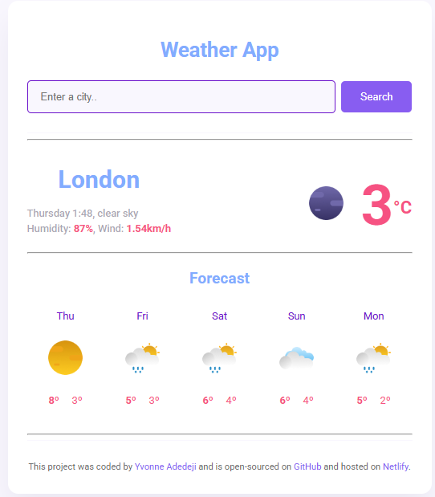
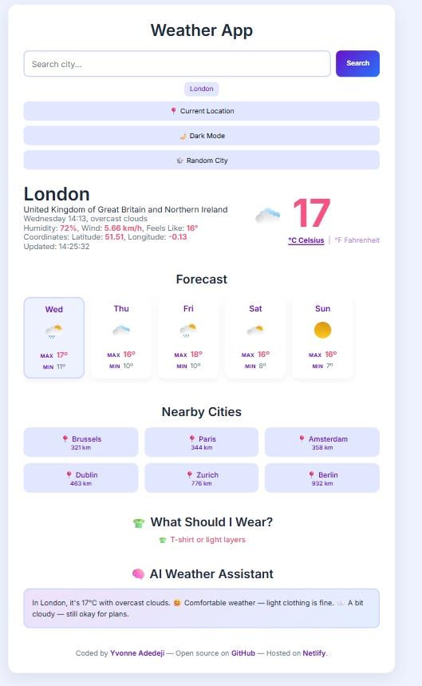
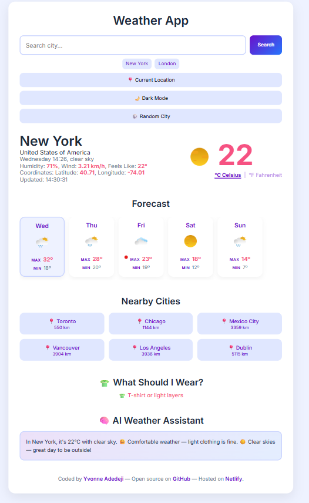
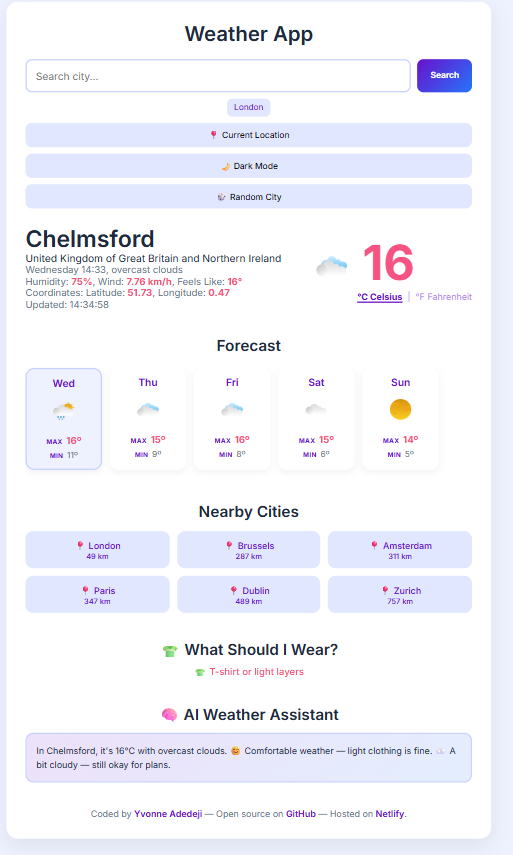
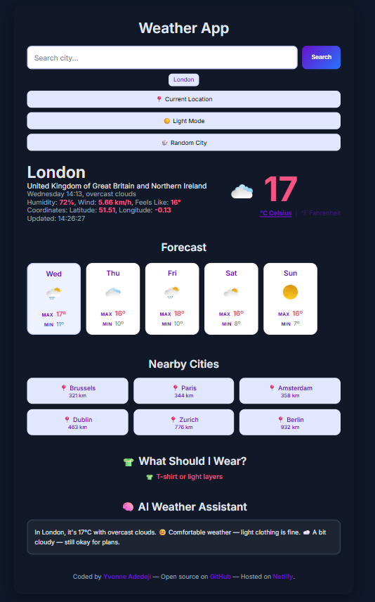

# weather-app

## 📌 Description
The Weather App is a responsive web application that provides real-time weather information and forecasts using the SheCodes Weather API. Users can search for any city and view current conditions, a 5-day forecast, nearby cities, and AI-powered weather insights in a clean, interactive interface.

## 🛠 Prerequisites
* 🌐 A modern web browser such as Chrome, Firefox, Safari, or Edge
* 📶 An active internet connection to fetch live weather data from the API
  
## 📋 Features
* Users can search for a city's weather by entering its name.
* Displays real-time temperature, humidity, and wind speed.
* Shows weather description and an appropriate icon.
* Provides a 5-day weather forecast.
* Responsive design for better user experience across devices.

 ## 💻 Technologies Used
The application is built with the following technologies:
* HTML
* CSS
* JavaScript
* Axios 
* SheCodes Weather API

## 🚀 Installation
No installation is required to use the app. It is hosted online and can be accessed via a web browser.

## 📚 Usage
To use the app:
1. Open the app in your web browser.
2. Enter a city name in the search bar
3. Press Search
4. View:
* Current weather conditions
* Forecast for the next 5 days
* Nearby cities
* AI weather advice
5. Optional:
* Use 📍 current location
* Toggle 🌙 dark mode
* Switch °C / °F
* Try 🎲 random city

## 🔗 Live Demo & Repository
Application can be viewed here: 
* 🌐 Live: https://ya-weather-app.netlify.app/
* 💻 Repository: (https://github.com/yvonnesarah/weather-app
  
## 🖼 Screenshot
Before Design

Weather App Interface

After Design

Weather App Interface

Weather App Interface - Random City Button Pressed

Weather App Interface - Current Location

Weather App Interface - Dark Theme

## 🗺️ Roadmap (Planned Features)
To enhance the functionality and user experience of the Weather App, the following improvements are planned:

🎲 Random City Feature
* Quickly generates a random city from a predefined list ✅
* Instantly loads weather without manual input ✅

🗺️ Nearby Cities Finder
* Calculates nearest cities using geographic coordinates ✅
* Uses the Haversine formula for accurate distance calculation ✅
* Displays 6 closest cities dynamically ✅
* Each city is clickable to load its weather ✅

🧠 AI Weather Assistant
* Generates intelligent weather insights based on: Temperature, Wind speed, Humidity, Weather conditions ✅
* Produces human-like weather summaries and advice ✅

👕 Clothing Recommendation System
* Suggests outfits based on weather conditions ✅
* Uses temperature and weather type (rain, snow, etc) ✅
* Example outputs: jackets, hoodies, light clothing, boots, umbrella suggestions ✅

## 🚀 Upcoming Features
These enhancements of Weather App are aimed at improving usability, enhancing visual appeal, and creating a smoother overall experience:

🕘 Search History System
* Stores last 5 searched cities ✅
* Displays clickable history buttons ✅
* Allows instant re-search of previous locations ✅

🌙 Dark Mode Toggle
* Switches between light and dark themes ✅
* Dynamically updates UI colors using CSS variables ✅
* Button text updates automatically ✅

🌡️ Temperature Unit Converter
* Converts temperature between Celsius and Fahrenheit ✅
* Instant toggle without refetching API data ✅
* Maintains original temperature for accuracy ✅

## 🧠 Advanced Features (Professional Level)
These enhancements elevate the Weather App by improving security, performance, and overall user experience:

⏳ Loading State System
* Shows loading indicator during API calls ✅
* Improves user experience during data fetching ✅

⚠️ Error Handling System
* Displays user-friendly error message when city is not found ✅
* Hides broken or incomplete UI states ✅

🔄 Live UI Updates
* Continuously updates “Last Updated” time every second ✅
* Provides real-time feedback on data freshness ✅

📱 Responsive UI Enhancements
* Optimized layout for mobile, tablet, and desktop ✅
* Horizontal scrolling for forecast and nearby cities on small screens ✅
* Adaptive typography and spacing for different devices ✅

🎨 Modern UI Design System
* Gradient buttons and clean card-based layout ✅
* Smooth hover animations and transitions ✅
* Consistent spacing and shadow design system ✅
* Built with CSS variables for easy theming ✅

🌐 API Integration Layer
* Uses Axios for all HTTP requests ✅
* Fetches: Current weather data, 5-day forecast data ✅
* Fully dynamic data rendering ✅

## 🧠 Challenges & Learnings
🚧 Challenges Faced

1. API Integration Complexity – Handling asynchronous requests with Axios and ensuring consistent data rendering from the SheCodes Weather API.
2. Geolocation Accuracy – Implementing the current location feature while managing browser permissions and fallback behaviors.
3. Nearby Cities Calculation – Using the Haversine formula to accurately compute distances between cities and dynamically sort results.
4. State Management in Vanilla JavaScript – Keeping UI elements (weather, forecast, theme, history) in sync without a framework.
5. Responsive Design – Ensuring a seamless experience across mobile, tablet, and desktop devices with flexible layouts.
6. Error Handling – Gracefully managing invalid city searches, failed API requests, and empty responses without breaking the UI.

📚 Key Learnings

1. Improved understanding of REST API consumption using Axios and handling asynchronous JavaScript.
2. Gained experience in transforming raw API data into meaningful UI components.
3. Strengthened skills in responsive design and CSS architecture, including the use of variables for theming (light/dark mode).
4. Learned how to implement real-world algorithms like the Haversine formula for geospatial calculations.
5. Improved debugging and problem-solving skills when working with dynamic UI updates and multiple interconnected features.
6. Enhanced ability to design a user-friendly experience, focusing on clarity, speed, and interactivity.

## 👥 Credit
Designed and developed by Yvonne Adedeji.

Weather data powered by SheCodes Weather API.

## 📜 License
This project is open-source. For licensing details, please refer to the LICENSE file in the repository.

## 📬 Contact
You can reach me at 📧 yvonneadedeji.sarah@gmail.com.
